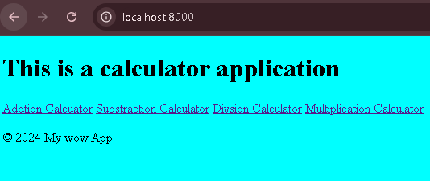
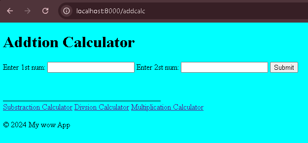
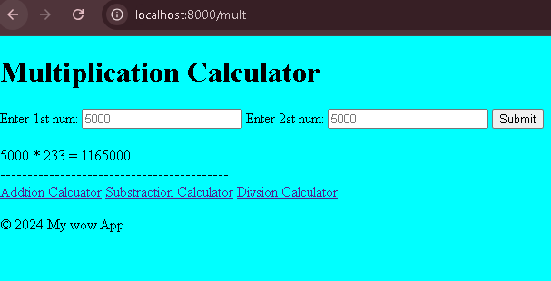

# This app is my first MVT app

A web application built with Django, a python framework for web application.

## Table of Contents

- [Introduction](#introduction)
- [Features](#features)
- [Installation](#installation)
- [Usage](#usage)
- [Preview](#Preview)

## Introduction

This project is a python based web django application designed to to clculate numbers.

## Features

- It has add view
- It has sustraction app
- It has Multiplication app
- It has division app
- It has a home app
- each app use POST method
  
## Preview
<!--  -->


Sample screenshoot for addtion app

<!--  -->

Sample screenshoot for multiplication app

<!--  -->


<video  width="640" height="480" controls poster="" autoplay>
  <source src="assets/images/REC.mp4" type="video/mp4">
  Your browser does not support the video tag.
</video>

## Installation

To set up the project locally, follow these steps:

1. **Clone the repository:**

    ```bash
    git clone https://github.com/your-username/your-laravel-repository.git
    ```

2. **Navigate to the project directory:**

    ```bash
    cd your-laravel-repository
    ```

3. **Install the dependencies:**

    ```bash
    composer install
    ```


## Usage

To start the development server, run:

```bash
php artisan serve
